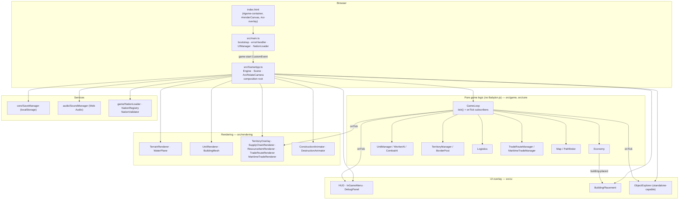

# S4WN — System Architecture

> This document is the high-level entry point for understanding the S4WN codebase. It summarizes data flow, key entry points, and module responsibilities. For agent rules, conventions, commands, and guardrails, see [AGENTS.md](../AGENTS.md). For game data, see [BASE.md](../BASE.md) (never modify it).

S4WN is a web-native reimplementation of *The Settlers IV* built with **TypeScript + Babylon.js**. It runs entirely in the browser (WebGL/WebGPU), uses no original game files, and generates all assets procedurally.

---

## 1. High-Level Architecture

The app splits into three concentric layers:

1. **Bootstrap / Menu layer** — lightweight, no 3D engine. `main.ts` initializes global error handling, the `UIManager` (splash → main menu → nation select), and the `NationLoader` registry.
2. **Game Application layer** — the heavy Babylon.js `GameApp`, loaded **lazily via dynamic `import()`** only when the player starts/loads a game. It owns the engine, scene, camera, `GameLoop`, and wires game logic to rendering and UI.
3. **Game Logic layer** — pure, deterministic TypeScript modules (economy, units, pathfinding, AI, territory, logistics, trade) that contain **no Babylon.js imports** and are unit-testable without a 3D engine.

```
Browser
   │  loads index.html
   ▼
src/main.ts  ── errorHandler.init() · UIManager (menu) · NationLoader.discover()
   │  waits for window 'game-start' CustomEvent {nation, mode}
   ▼  dynamic import() ▲ lazy (keeps first paint fast)
src/GameApp.ts ── Babylon Engine/Scene · ArcRotateCamera · wiring
   ├─ pure logic   → GameLoop ─┬─ Economy
   │                            ├─ UnitManager
   │                            ├─ WorkerAI
   │                            ├─ CombatAI
   │                            ├─ TerritoryManager
   │                            ├─ Logistics
   │                            ├─ TradeRouteManager
   │                            └─ MaritimeTradeManager        (each tick())
   ├─ rendering   → TerrainRenderer · WaterPlane · UnitRenderer · BuildingMesh
   │                · TerritoryOverlay · SupplyChainRenderer · ResourceItemRenderer
   │                · TradeRouteRenderer · MaritimeTradeRenderer · Construction/DestructionAnimator
   │                · ShadowPipeline · ParticleSystem · GridRenderer
   ├─ UI overlay  → HUD · InGameMenu · DebugPanel · BuildingPlacement
   │                · ObjectExplorer (standalone-capable) · TutorialDialog · EntityInfoTooltip/DetailPanel
   └─ services    → SaveManager (localStorage) · SoundManager (Web Audio)
```

---

## 2. Data Flow

### 2.1 Boot & Game Start
1. `index.html` loads `src/main.ts` (Vite publicDir = `assets/`).
2. `errorHandler.init()` installs global unhandled-error handlers.
3. `UIManager` shows the splash screen, then the main menu; `NationLoader.discover()` reads `assets/nations/*/manifest.json` and `rebuildLegacyConstants()` repopulates legacy constants (`NATION_NAMES`, etc.).
4. On `game-start`, `main.ts` bridges the splash, dynamic-imports `GameApp`, constructs it with `(canvasId, mode, nation)`, and awaits `app.readyPromise` before hiding the loader.

### 2.2 Simulation Loop
- `GameApp` registers a Babylon render loop. Each frame it calls `gameLoop.tick()`.
- `GameLoop.tick()` advances economy production, unit/AI decisions, territory, logistics carrier movement, and trade missions.
- Tick subscribers (HUD, ObjectExplorer, renderers like `TerritoryOverlay`, `SupplyChainRenderer`, `ResourceItemRenderer`, `TradeRouteRenderer`, `MaritimeTradeRenderer`) refresh via `GameLoop.onTick()`.

### 2.3 Interaction
- Picking on the canvas → `BuildingPlacement` ghost preview → `Economy`/`TerritoryManager` validation → `building-placed` CustomEvent → `BuildingMesh` + `ConstructionAnimator`.
- `DebugPanel` toggles overlays (grid, territory, supply, maritime trade, Babylon Inspector).

### 2.4 Persistence & Audio
- `SaveManager` serializes `GameLoop`/`Economy`/`Map` to `localStorage`; restore on `mode === 'load'`.
---

## 3. Module Responsibilities

### `src/main.ts` (bootstrap)
Entry point; global error handling; lightweight menu; lazy `GameApp` import triggered by `game-start`; cleanup on `game-exit`/`beforeunload`.

### `src/GameApp.ts` (composition root)
Owns the Babylon `Engine`/`Scene`/`ArcRotateCamera`; instantiates and wires all game-logic, rendering, UI, and service modules; runs the render loop; exposes `readyPromise`; disposes everything on exit.

### `src/game/` (pure game logic — no Babylon.js)
| Module | Responsibility |
|--------|----------------|
| `GameLoop.ts` | Tick-based simulation orchestrator; emits `onTick` to subscribers |
| `Economy.ts` | Resources, buildings, production chains, storage capacity (StorageYard-aware) |
| `Unit.ts` / `UnitManager.ts` | Unit model + lifecycle/state/stance |
| `WorkerAI.ts` | Worker/settler assignment & movement |
| `CombatAI.ts` | Military unit behavior |
| `Pathfinder.ts` | A* pathfinding with terrain costs |
| `TerritoryManager.ts` | Territory ownership + `placeBorderPosts()` |
| `BorderPost.ts` | Border post model |
| `Logistics.ts` | Carrier/resource demand–supply matching, physical `ResourceItem`s |
| `TradeRouteManager.ts` | Donkey land trade routes between Marketplaces |
| `MaritimeTradeManager.ts` | Ship trade between LandingDocks |
| `ConstructionManager.ts` | Building construction progress |
| `Nation.ts` / `NationLoader.ts` / `NationRegistry.ts` / `NationValidator.ts` | Nation packs, registry, validation |
| `TutorialManager.ts` | Interactive tutorial steps |
| `Map.ts` | Terrain, elevation, resources |
| `types.ts` | Domain enums/interfaces (Terrain, ResourceType, UnitKind, …) |
| `particles/ParticleSystem.ts` | Particle effects |

### `src/rendering/` (Babylon.js rendering — side-effect layer)
Terrain, water, grids, units, buildings, territory overlay, supply-chain + resource-item + trade-route + maritime trade visualizers, construction/destruction animators, shadows, particles.

### `src/ui/` (DOM overlay)
`UIManager`, `HUD`, `InGameMenu`, `DebugPanel`, `BuildingPlacement`, `ObjectExplorer` (+ `explorer/*` submodules), `TutorialDialog`, `EntityInfoTooltip`, `EntityDetailPanel`, `PlacementValidator`, `styles.css`.

### `src/core/` (cross-cutting)
`Logger`, `ErrorHandler`, `ErrorOverlay`, `SaveManager`, `ViewCuller`, `CapabilityChecker`, `Assert`.

### `src/audio/`
`SoundManager` — procedural Web Audio.

### `src/economy/`
`types.ts` — authoritative `BuildingType`, `ResourceType` (19), `ToolKind`, production chains, costs, metadata.

### Support
- `tests/` — Playwright config + UI/visual specs; `jest.config.js` maps Babylon mocks.
- `scripts/` + `scripts/generators/` — procedural asset generation (Python/Node).
- `assets/` — generated textures/models/UI/nations (Vite publicDir).
- `.github/workflows/ci.yml` — typecheck → unit tests → (UI optional) → build → Docker multi-arch.

---

## 4. System Architecture (Mermaid)



---

## 5. Key Entry Points

| Concern | Entry point |
|---------|-------------|
| App boot | `src/main.ts` |
| Game init / composition | `src/GameApp.ts` (constructor + `initSystems`/`initRendering`/`initUI`/`initLoop`) |
| Simulation step | `src/game/GameLoop.ts` → `tick()` |
| Economy data | `src/economy/types.ts` |
| Nation packs | `assets/nations/*/manifest.json` → `NationLoader` |
| Save/load | `src/core/SaveManager.ts` |

---

## 6. Testing Strategy

- **Unit (Jest)** — colocated in `src/**/__tests__/`; run with `npm test`.
- **Visual regression / UI (Playwright)** — `tests/ui/*.spec.ts` with committed baselines; run with `npm run test:ui`.
- **Unified gate** — `npm run check` (typecheck + unit) and `npm run check:full` (+ UI).
- **Asset validation (Python)** — `scripts/validate_config.py`, `scripts/validate_test_maps.py`.
- `SoundManager` synthesizes procedural sounds (Web Audio API — no original S4 audio).